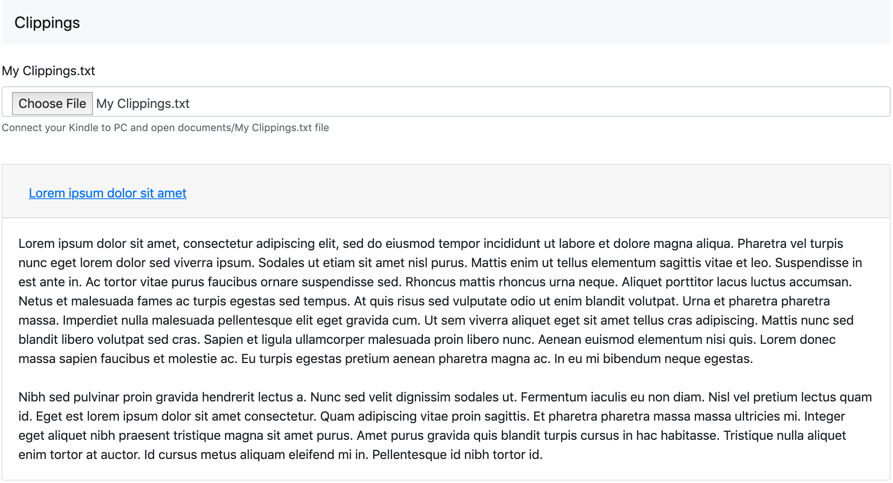

# Kindle Clippings

This is a SPA application tool for process and shows Kindle's My Clippings txt file in a clear format per books.

*This tool only use client side technologies: Vanilla JS, Bootstrap.*



## Installation

```sh
clone git@github.com:arcadas/clippings.git
cd clippings
npm install
open index.html
```
